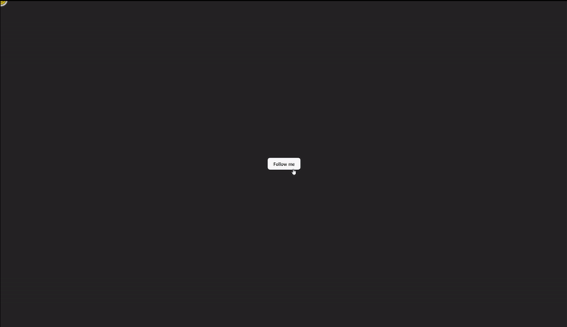

# 🖱️ Mouse Follower

This project is a simple **Mouse Follower** built with **React**. It demonstrates how to track the mouse position dynamically using the `useEffect` hook, along with basic event handling to create an interactive UI element that follows the cursor in real-time.

## 🚀 Key Features

- **Real-Time Cursor Tracking:** Smooth movement of elements following the mouse.
- **React Hooks:** Implementation of `useEffect` to manage event listeners efficiently.
- **Responsive Design:** Works seamlessly across different screen sizes.
- **Clean Code Structure:** Easy-to-read and maintainable code.

## 🎥 Demo

## 💡 Technologies Used

- **React** – For building the UI.
- **JavaScript (ES6+)** – Core logic implementation.
- **CSS** – For styling the follower element.

