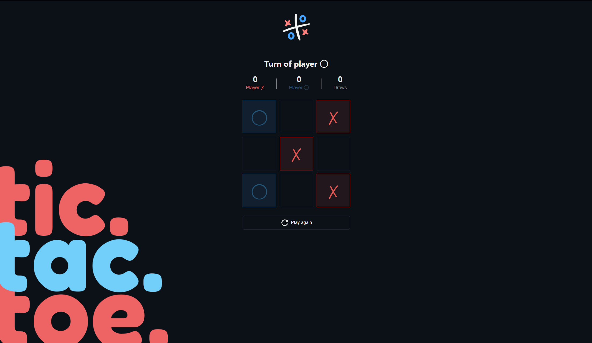

# Tic Tac Toe
This is a simple yet engaging Tic Tac Toe game built with React. The goal of this project is to showcase my skills in state management, game logic implementation, and creating interactive user interfaces. It was designed with clean code principles and a focus on usability, making it an ideal addition to my development portfolio.

# 🎯 Project Overview
The game allows two players to take turns marking spaces in a 3x3 grid, aiming to get three of their marks in a row—horizontally, vertically, or diagonally. The logic efficiently handles turn switching, winner detection, and draw conditions.

# ✨ Features
Responsive Design: Works seamlessly on desktop and mobile devices.
- Game Logic: Detects winners and draws automatically.
- State Management: Utilizes React's useState for dynamic UI updates.
- Reset Functionality: Restart the game instantly without refreshing the page.
- Clean Codebase: Modular components and readable code for easy maintenance.

This project is part of my portfolio to demonstrate my ability to build interactive web applications using React.
